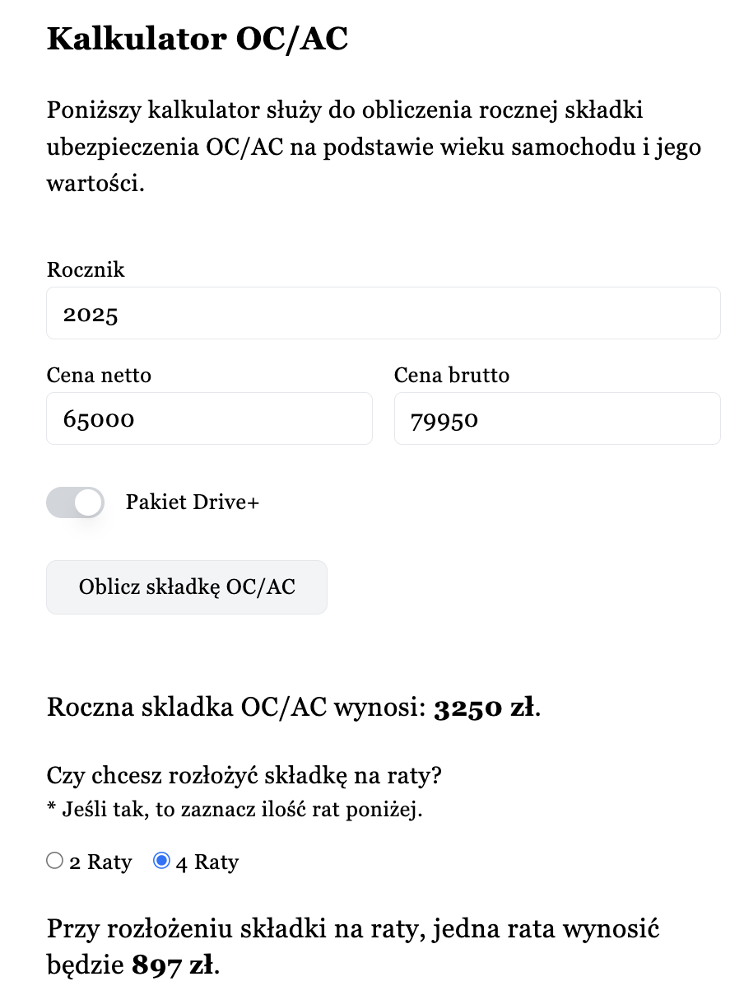

### Kalkulator do obliczania rocznej składki OC/AC

#### Technologie:
Vue3, Nuxt3, Tailwind

#### Setup:
- npm install (to install dependencies)
- npm run dev (to run the server)

The development server should be on `http://localhost:3000`

#### Project Preview:

